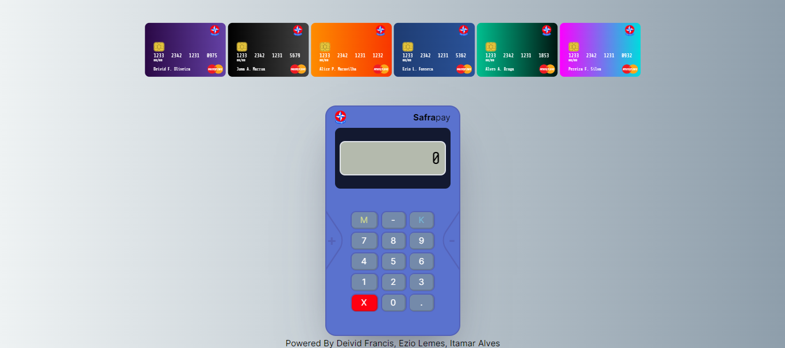

# BANCO IMOBILIARIO
☑️JOGO EM HTML/CSS/JS.

   

## DESCRIÇÃO:
Este é um jogo de simulação de transferências de valores entre cartões. Aqui está uma descrição de como o jogo funciona:

1. **Inicialização do jogo**: Assim que a página é carregada, são inseridos cartões padrão e a máquina de cartões é inicializada. A carteira é renderizada na tela.

2. **Funcionalidade dos botões**: Os botões na interface do jogo que são ativados quando clicados. Cada botão executa uma função específica, como inserir números, limpar valores, ou transferir valores entre os cartões.

3. **Transferência de valores entre cartões**: Quando um valor é inserido e os cartões de origem e destino são selecionados, o jogo simula a transferência desse valor entre os cartões. Os valores nos cartões são atualizados de acordo com a transferência.

4. **Animações e efeitos sonoros**: O jogo possui animações e efeitos sonoros para tornar a experiência mais interativa e imersiva. Por exemplo, quando os valores são transferidos entre os cartões, há animações de transição e sons de clique.

5. **Validações e limitações**: O jogo possui algumas validações, como o limite máximo de caracteres para inserção de valores, e emite alertas quando essas validações não são cumpridas.

6. **Interatividade da interface**: A interface do jogo permite ao jogador selecionar os cartões de origem e destino para a transferência de valores, e exibe os cartões disponíveis na carteira.

## NÃO SABE?
- Entendemos que para manipular arquivos em `HTML`, `CSS` e outras linguagens relacionadas, é necessário possuir conhecimento nessas áreas. Para auxiliar nesse aprendizado, oferecemos cursos gratuitos disponíveis:
* [CURSO DE HTML E CSS](https://github.com/VILHALVA/CURSO-DE-HTML-E-CSS)
* [CURSO DE JAVASCRIPT](https://github.com/VILHALVA/CURSO-DE-JAVASCRIPT)
* [CONFIRA MAIS CURSOS](https://github.com/VILHALVA?tab=repositories&q=+topic:CURSO)

## CREDITOS:
- [PROJETO CRIADO PELO "localhost-io"](https://github.com/localhost-io/super-banco-imobiliario)
- [PROJETO FEITO PELO VILHALVA](https://github.com/VILHALVA)
